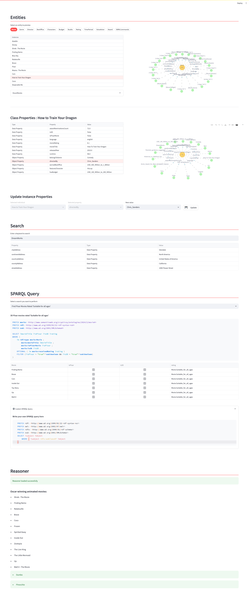
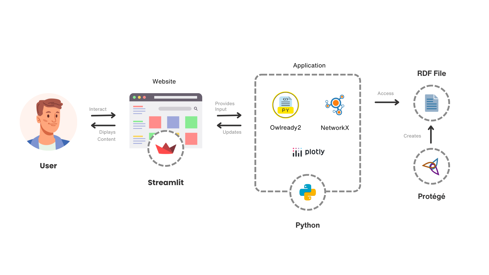

# Semantic Programming for Ontology Development

This project develops a semantic programming application tailored for the animated film industry. The application uses semantic technologies to organize and analyze complex data sets from animated films, leveraging ontologies and RDF files to facilitate this process.

<div align=center>
 
</div>


## System Overview

The application loads and processes ontologies using Owlready2 in Python, enabling the extraction and visualization of data through an intuitive user interface built with Streamlit. It supports complex queries with SPARQL and provides interactive network graphs of relationships within the film industry using Plotly and NetworkX.


<div align=center>
 
</div>


## Pre-requisites

##### Conda Environment
Create a separate conda environment with the python version 3.11 using the following command:

```
conda create -n semantics python=3.11
```

then activate the environment:

```
conda activate semantics
```
 
and install the required libraries using the following command:

```
pip install -r requirements.txt
```
<br/>


## Usage


```bash
# activate the conda environment
conda activate semantics

# run the flask application
python run.py
```