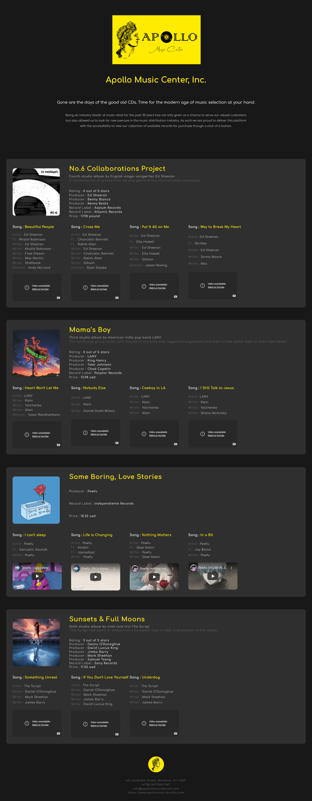

# Apollo Music Center

"Gone are the days of the good old CDs. Time for the modern age of music selection at your hand."

That's how I'd want to brand a hypothetical company that intended to build their website in the most multipurpose system possible using XML. However, I am not a businessman, and the website is only a prototype of the full potential that some xml and css can have.

Preview the  website [here](./apollo.xml).

 <b>Note:</b> The file also contains XSD and DTD schema for data validation.
 

 
 

