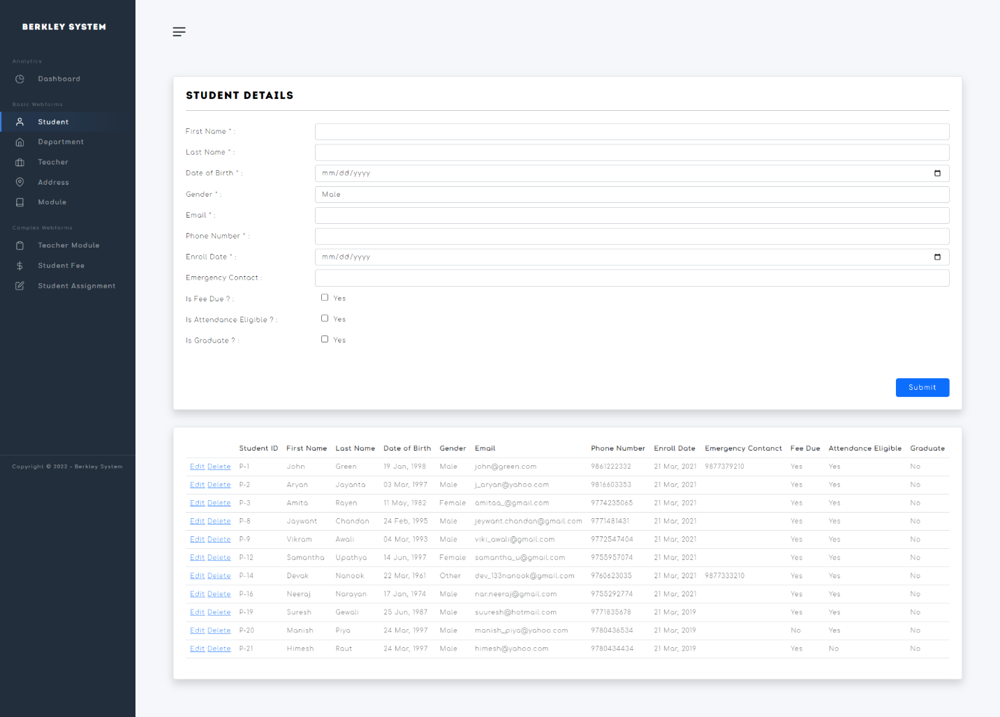
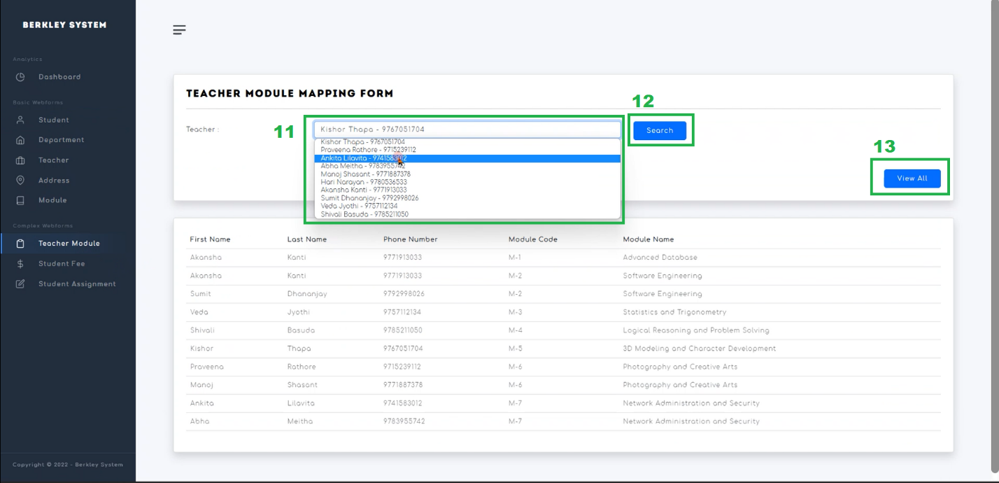
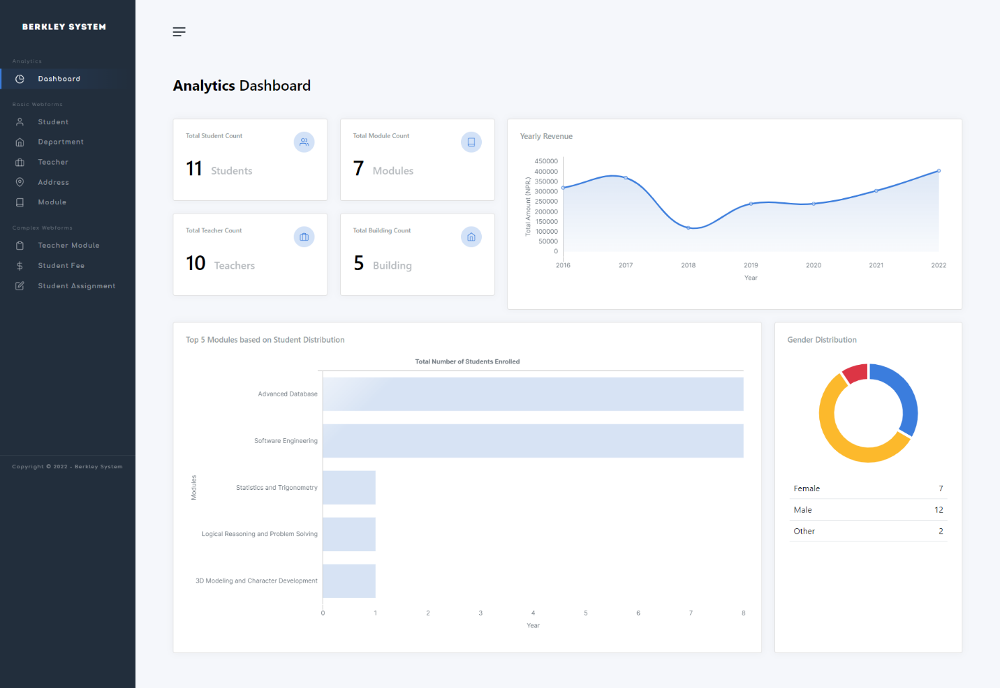

# Berkley College System

A simple way for displaying the most crucial data about college life. Yes, your important information is in the college database.
 

## Index
- [About](#about)
- [Requirements](#requirements)
- [Application Preview](#preview)
 

## About
Berkley College System is a .NET application system that manages and displays the records of students and faculties within the college. Using an aesthetically pleasing interface, the system allows the user to perform the CRUD features within the entities of the database.
 

## Requirements

- 	The.NET Framework [Ideally V.4] must be installed on the system.
- 	Run the sql commands inside the `SQL Scripts` file to create a database for the system.
 

## Application Preview

    

 

    

 

    

 

    

