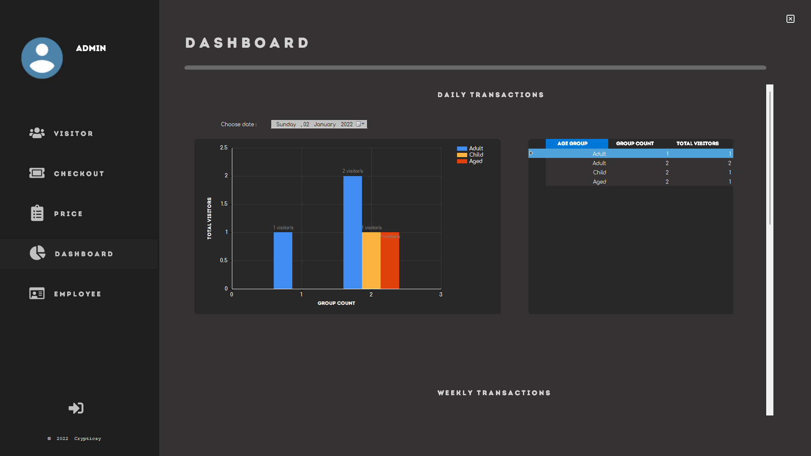
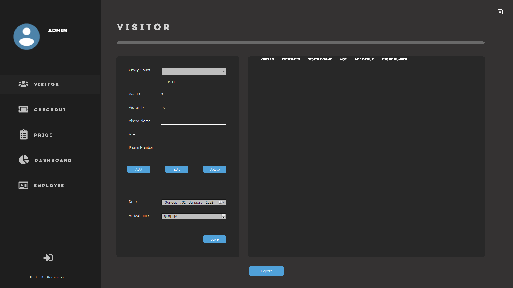
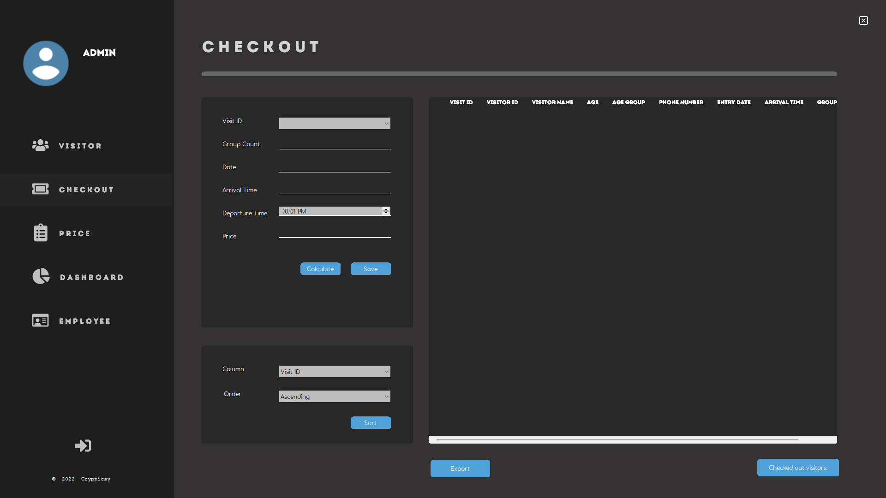
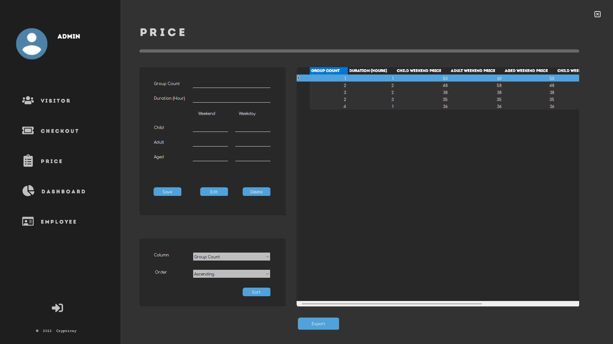
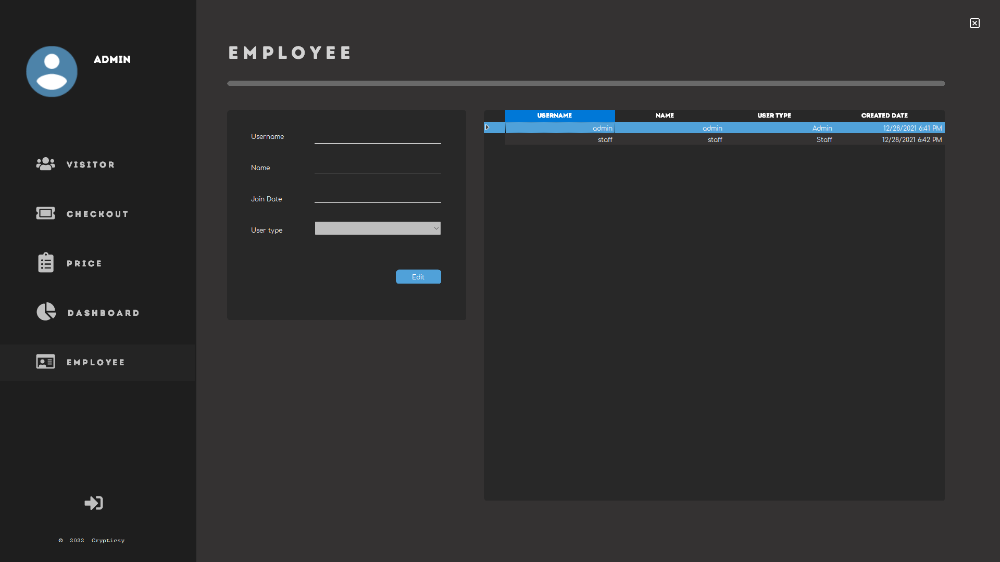

# Hermes Ticket Management System

Always wondered how to manage tickets in a recreation center?
Now you can stop wondering since here is the answer to all of your concerns and issues.
If you had an issue with your ticket in the first place, this may be for you, yes you. Try it today for just $##.##.

Don't you think that would be a terrific campaign to advertise for? So, jokes aside, the project is a simple ticket management system that records customers visits and allows you to manage your tickets, while effortlessly providing you a simple interface to alter your ticket rates.
 

## Index
- [About](#about)
- [Requirements](#requirements)
- [Application Preview](#preview)
 

## About
Hermes Ticket Management System is a .NET application system that automates the process of collecting ticket and visitor records inside a recreation through a userfriendly GUI 
The application has multiple level of access based on user level, as well as an interactive user interface to help with the ticketing process.
 

## Requirements

- 	The.NET Framework [Ideally V.4] must be installed on the system.
- 	Visual Studio must be installed.
 

## Application Preview

    

 

    

 

    

 

    

 

    

 

    

 

    

 

    

