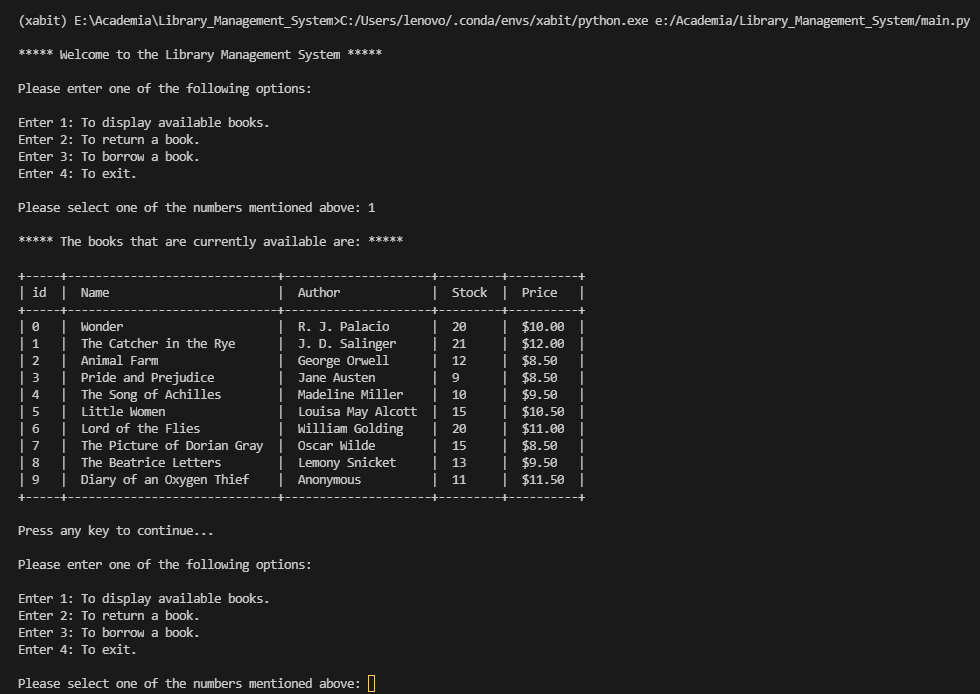

# Library Management System

Agh. its another management system, as if the world didn't have enough of them. I agree too, there are plenty and this one is no different. Yet, I just can't stop myself from adding this as it goes through the most fundamental CRUD application without the starting C.

 

 
  

#### Access the file

Execute `main.py `  file in your terminal.
