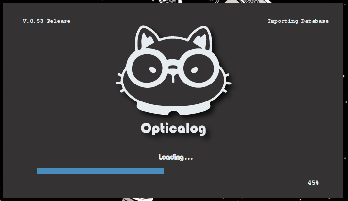
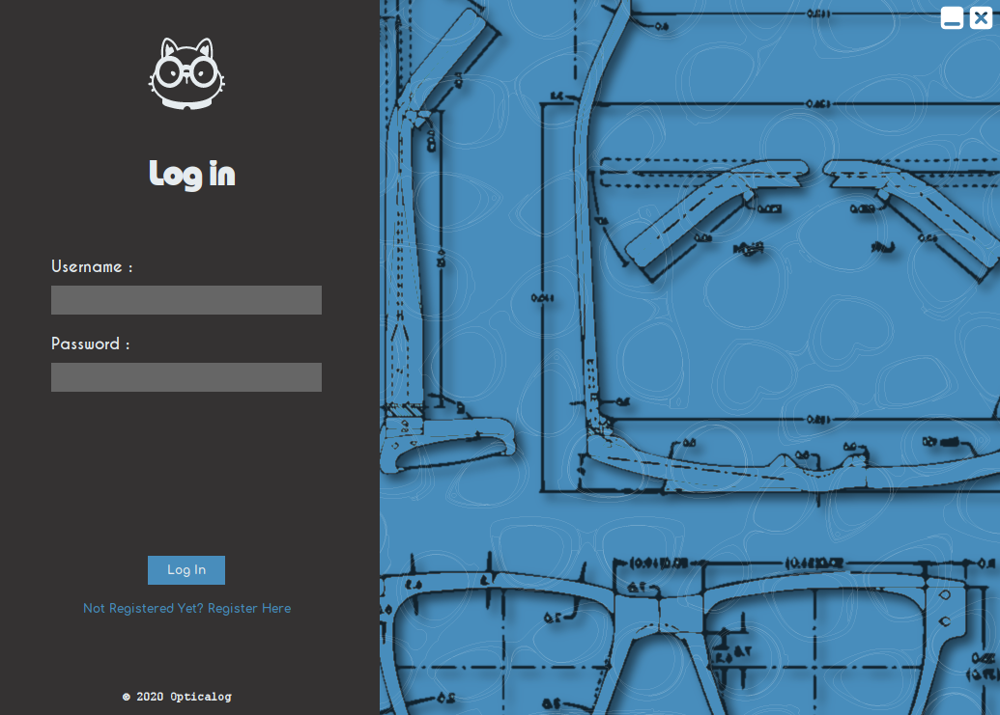
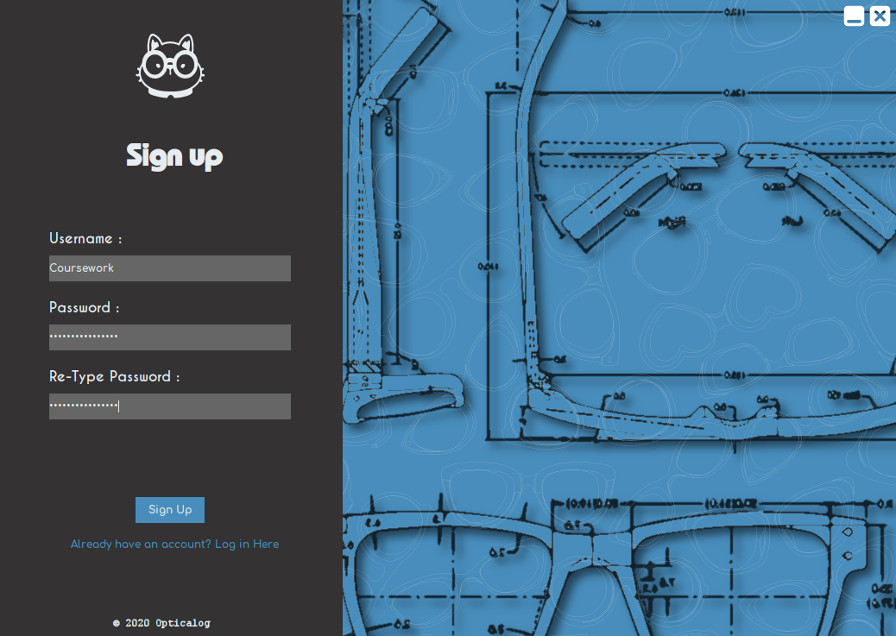
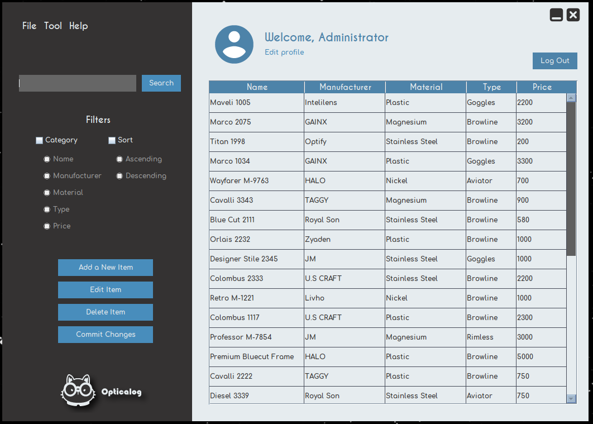
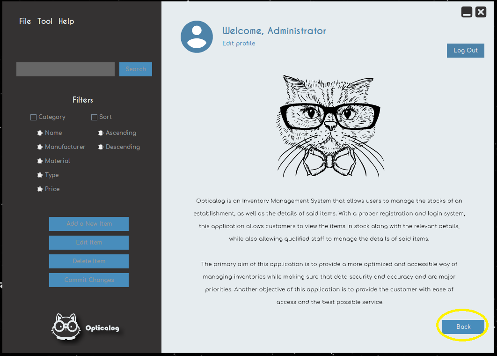
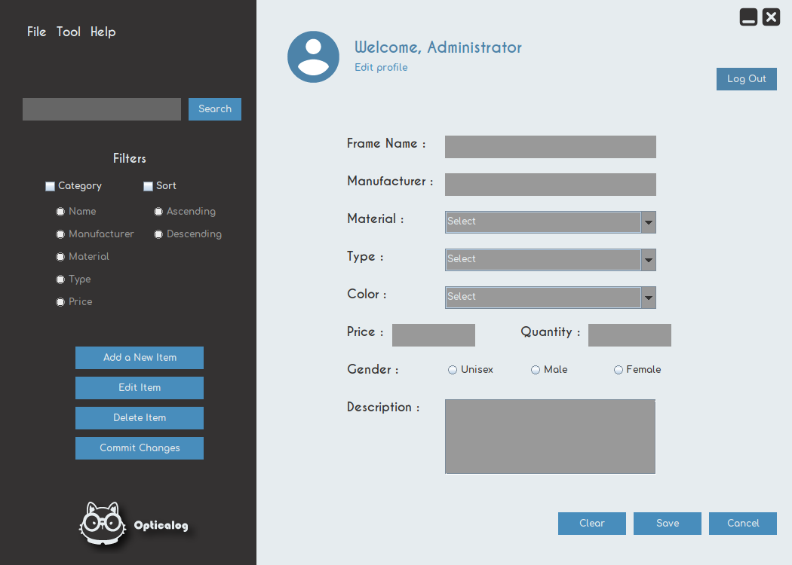

# Opticalog

Glasses are a part of me, but they are also a part of the industry. If you just want to keep track of your stock pile of glasses, opticalog is the solution for you, since you can monitor your available products in a simple UI, all built to ensure that it is effortless to use.

 

 
  

 
  

 
  
 

  
 

  
 

  

#### Run the application

* Open the folder `opticalog` in net beans.
* Run the MainClass.java file.

