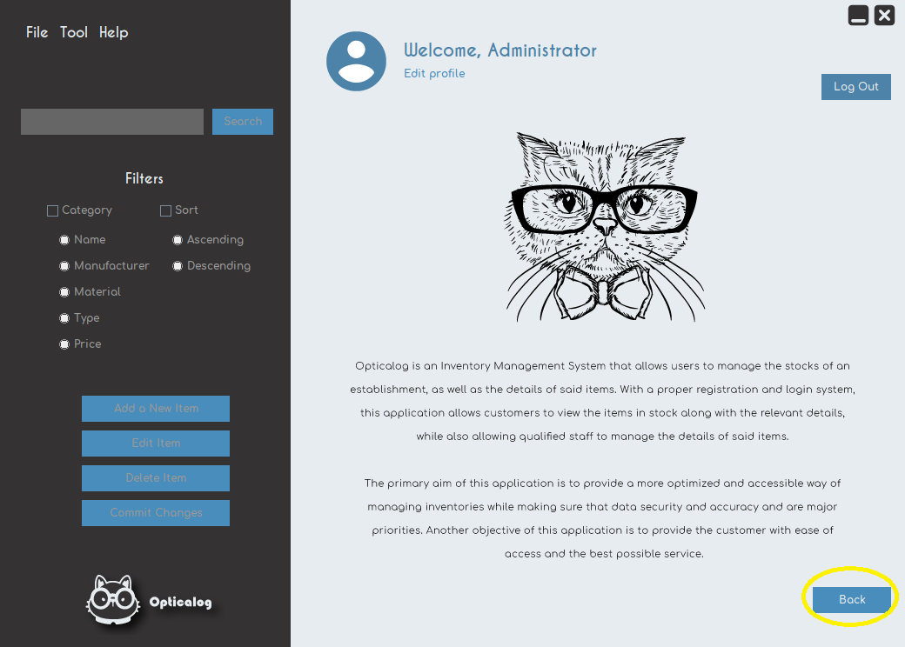

# Opticalog

Glasses are a part of me, but they are also a part of the industry. If you just want to keep track of your stock pile of glasses, opticalog is the solution for you, since you can monitor your available products in a simple UI, all built to ensure that it is effortless to use.
  

#### Run the application

- Open the folder `opticalog` in net beans.
- Run the MainClass.java file.
    

  
  Splash scrren
  
  
 
  

Log in page

  
 
  

Sign up page

  

  

Main menu

  

  

Product addition

  
  

About opticalog

  
 

