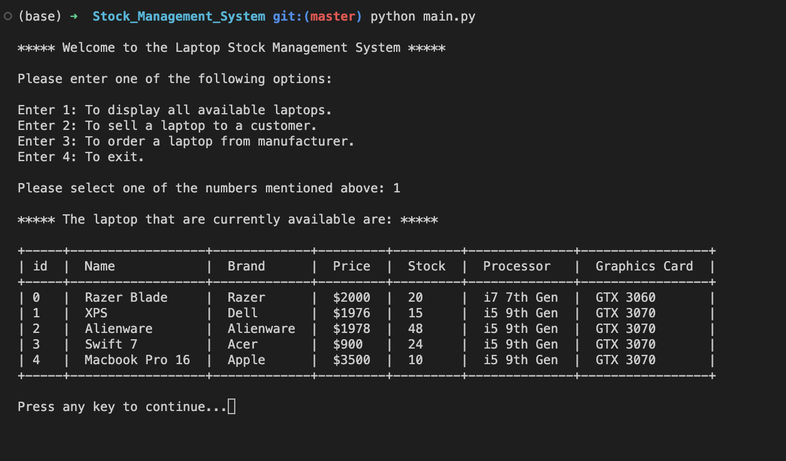

# Stock Management System

Agh. Here we go again. Its another management system, as if the world didn't have enough of them. I agree too, there are plenty and this one is no different. Yet, I just can't stop myself from adding this as it goes through the most fundamental CRUD application without the starting C.
<br/><br/>

#### Access the file

Execute the following command in your terminal to access the system
```
python main.py
``` 


<div align=center>
  
</div>

